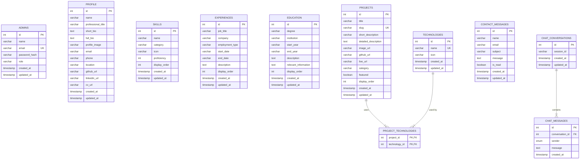

# 🗄️ MySQL Database Architecture - `portfolio_db`

A robust, relational, normalized MySQL 8+ database schema specifically designed for **Muhammad Hassan Iqbal's** personal Full Stack Developer portfolio website and admin management system.

---

## 🏛️ System Architecture

```
┌──────────────────────────────────────────────┐
│             Next.js 14 Frontend              │
│       (App Router, React, JavaScript)        │
│          Runs on http://localhost:3001        │
└──────────────────────┬───────────────────────┘
                       │ REST APIs (JSON / Cookies / JWT)
                       ▼
┌──────────────────────────────────────────────┐
│       Node.js + Express.js Backend API       │
│        (Security, Rate Limiting, Auth)       │
│          Runs on http://localhost:5000        │
└──────────────────────┬───────────────────────┘
                       │ Connection Pool (mysql2/promise)
                       ▼
┌──────────────────────────────────────────────┐
│                MySQL Database                │
│    (11 Normalized Tables, utf8mb4 collation) │
│          Database: portfolio_db:3306         │
└──────────────────────────────────────────────┘
```

---

## 📋 Database Specifications

- **Database Name**: `portfolio_db`
- **RDBMS Engine**: MySQL 8.0+
- **Storage Engine**: `InnoDB` (ACID compliance, row-level locking, foreign key enforcement)
- **Default Character Set**: `utf8mb4` (Full 4-byte UTF-8 for internationalization, Urdu script, emojis)
- **Default Collation**: `utf8mb4_unicode_ci` (Accent-insensitive, case-insensitive linguistic sorting)

---

## 📊 Entity Relationship Diagram (ERD)



---

## 🗃️ Complete Table Dictionary (11 Tables)

### 1. `admins`
Stores authorized administrative accounts that can log into the dashboard.
- `id` (INT, AUTO_INCREMENT, PRIMARY KEY): Unique identifier.
- `name` (VARCHAR(100), NOT NULL): Full name of the admin.
- `email` (VARCHAR(150), NOT NULL, UNIQUE): Admin login email address.
- `password_hash` (VARCHAR(255), NOT NULL): Bcrypt password hash (never stored in plain text).
- `role` (VARCHAR(50), NOT NULL, DEFAULT 'admin'): Role authorization level (`admin`).
- `created_at` (TIMESTAMP, DEFAULT CURRENT_TIMESTAMP).
- `updated_at` (TIMESTAMP, DEFAULT CURRENT_TIMESTAMP ON UPDATE CURRENT_TIMESTAMP).

### 2. `profile`
Stores the portfolio owner's public personal information.
- `id` (INT, AUTO_INCREMENT, PRIMARY KEY).
- `name` (VARCHAR(150), NOT NULL): e.g., "Muhammad Hassan Iqbal".
- `professional_title` (VARCHAR(200), NOT NULL): e.g., "Full Stack Developer".
- `short_bio` (TEXT, NOT NULL): Condensed overview for the Hero card.
- `full_bio` (TEXT, NOT NULL): In-depth biography for the About section.
- `profile_image` (VARCHAR(500), NULL): URL to avatar image.
- `email` (VARCHAR(150), NOT NULL): Public contact email.
- `phone` (VARCHAR(50), NULL): Contact phone number.
- `location` (VARCHAR(150), NULL): e.g., "Available for Remote & Hybrid Worldwide".
- `github_url` (VARCHAR(255), NULL): GitHub profile URL.
- `linkedin_url` (VARCHAR(255), NULL): LinkedIn profile URL.
- `cv_url` (VARCHAR(255), NULL): Path to CV PDF (`/resume.pdf`).
- `created_at`, `updated_at` (TIMESTAMP).

### 3. `skills`
Developer skills categorized for display in skill bars and badge clouds.
- `id` (INT, AUTO_INCREMENT, PRIMARY KEY).
- `name` (VARCHAR(100), NOT NULL): e.g., "React.js", "Node.js", "MySQL".
- `category` (VARCHAR(50), NOT NULL): "frontend", "backend", "database", "tools", "cloud".
- `icon` (VARCHAR(50), DEFAULT 'Layers'): Lucide icon name.
- `proficiency` (INT, DEFAULT 85): Skill mastery (1-100%).
- `display_order` (INT, NOT NULL, DEFAULT 0): Custom visual ordering.
- `created_at`, `updated_at` (TIMESTAMP).

### 4. `experiences`
Work history and professional career timeline.
- `id` (INT, AUTO_INCREMENT, PRIMARY KEY).
- `job_title` (VARCHAR(150), NOT NULL): e.g., "Senior Full Stack Developer".
- `company` (VARCHAR(150), NOT NULL): e.g., "Apex Digital Solutions".
- `employment_type` (VARCHAR(50), NOT NULL, DEFAULT 'Full-time'): "Full-time", "Contract", "Freelance".
- `start_date` (VARCHAR(50), NOT NULL): e.g., "2023".
- `end_date` (VARCHAR(50), NULL): NULL indicates the current active job.
- `description` (TEXT, NOT NULL): Responsibilities and achievements.
- `display_order` (INT, NOT NULL, DEFAULT 0).
- `created_at`, `updated_at` (TIMESTAMP).

### 5. `education`
Academic degrees, certifications, and educational credentials.
- `id` (INT, AUTO_INCREMENT, PRIMARY KEY).
- `degree` (VARCHAR(200), NOT NULL): e.g., "BS in Computer Science (BSCS)".
- `institution` (VARCHAR(200), NOT NULL): e.g., "National University of Sciences & Technology".
- `start_year` (VARCHAR(20), NOT NULL): e.g., "2019".
- `end_year` (VARCHAR(20), NULL): e.g., "2023" (NULL for in-progress).
- `description` (TEXT, NOT NULL): Program summary.
- `relevant_information` (TEXT, NULL): Key coursework highlights.
- `display_order` (INT, NOT NULL, DEFAULT 0).
- `created_at`, `updated_at` (TIMESTAMP).

### 6. `projects`
Portfolio project showcase.
- `id` (INT, AUTO_INCREMENT, PRIMARY KEY).
- `title` (VARCHAR(200), NOT NULL): Project display title.
- `slug` (VARCHAR(200), NOT NULL, UNIQUE): Clean URL slug for `/projects/[slug]`.
- `short_description` (VARCHAR(500), NOT NULL): Card teaser summary.
- `detailed_description` (TEXT, NULL): Comprehensive project deep-dive.
- `image_url` (VARCHAR(500), NULL): Project screenshot.
- `github_url` (VARCHAR(500), NULL): Repository link.
- `live_url` (VARCHAR(500), NULL): Production deployment link.
- `category` (VARCHAR(50), NOT NULL, DEFAULT 'fullstack'): "frontend", "backend", "fullstack".
- `featured` (BOOLEAN, NOT NULL, DEFAULT FALSE): Featured status for homepage highlight.
- `display_order` (INT, NOT NULL, DEFAULT 0).
- `created_at`, `updated_at` (TIMESTAMP).

### 7. `technologies`
Master catalog of reusable software technologies and tools.
- `id` (INT, AUTO_INCREMENT, PRIMARY KEY).
- `name` (VARCHAR(100), NOT NULL, UNIQUE): Unique technology name (e.g., "React.js", "Docker").
- `icon` (VARCHAR(50), DEFAULT 'Cpu'): Visual icon name.
- `created_at`, `updated_at` (TIMESTAMP).

### 8. `project_technologies` (Many-to-Many Pivot Table)
Relates projects to technologies with referential integrity and cascading deletions.
- `project_id` (INT, NOT NULL, FOREIGN KEY -> `projects.id` ON DELETE CASCADE).
- `technology_id` (INT, NOT NULL, FOREIGN KEY -> `technologies.id` ON DELETE CASCADE).
- `PRIMARY KEY (project_id, technology_id)`.

### 9. `contact_messages`
Client inquiries received through the contact section.
- `id` (INT, AUTO_INCREMENT, PRIMARY KEY).
- `name` (VARCHAR(100), NOT NULL): Sender's name.
- `email` (VARCHAR(150), NOT NULL): Sender's email.
- `subject` (VARCHAR(255), NOT NULL): Message subject.
- `message` (TEXT, NOT NULL): Inquiry body.
- `is_read` (BOOLEAN, NOT NULL, DEFAULT FALSE): Unread/read status flag.
- `created_at`, `updated_at` (TIMESTAMP).

### 10. `chat_conversations`
Chatbot sessions for portfolio visitors.
- `id` (INT, AUTO_INCREMENT, PRIMARY KEY).
- `session_id` (VARCHAR(100), NOT NULL): Unique visitor cookie or session identifier.
- `created_at`, `updated_at` (TIMESTAMP).

### 11. `chat_messages`
Individual conversational messages between visitor and AI assistant.
- `id` (INT, AUTO_INCREMENT, PRIMARY KEY).
- `conversation_id` (INT, NOT NULL, FOREIGN KEY -> `chat_conversations.id` ON DELETE CASCADE).
- `sender` (ENUM('user', 'assistant'), NOT NULL).
- `message` (TEXT, NOT NULL).
- `created_at` (TIMESTAMP, DEFAULT CURRENT_TIMESTAMP).

---

## ⚡ Indexing Strategy

| Index Name | Table | Column(s) | Purpose |
|---|---|---|---|
| `idx_admins_email` | `admins` | `email` | Ultra-fast login lookup (`SELECT WHERE email = ?`) |
| `idx_skills_category` | `skills` | `category` | Instant grouping by skill category |
| `idx_skills_display_order` | `skills` | `display_order` | Preserves deterministic sorting without filesort |
| `idx_experiences_start_date` | `experiences` | `start_date` | Fast chronological ordering |
| `idx_experiences_display_order` | `experiences` | `display_order` | Timeline sorting |
| `idx_education_start_year` | `education` | `start_year` | Reverse-chronological credentials sorting |
| `idx_education_display_order` | `education` | `display_order` | Order preservation |
| `idx_projects_slug` | `projects` | `slug` | O(1) slug lookup for Next.js dynamic routes (`/projects/[slug]`) |
| `idx_projects_category` | `projects` | `category` | Tab filtering ("frontend", "backend", "fullstack") |
| `idx_projects_featured` | `projects` | `featured` | Instant filtering of featured projects for the hero section |
| `idx_projects_display_order` | `projects` | `display_order` | Catalog ordering |
| `idx_technologies_name` | `technologies` | `name` | Fast lookup when checking/inserting tech tags |
| `idx_pt_project_id` | `project_technologies` | `project_id` | Quick JOIN from project to technologies |
| `idx_pt_technology_id` | `project_technologies` | `technology_id` | Quick reverse lookup: find all projects using a technology |
| `idx_contact_messages_is_read` | `contact_messages` | `is_read` | Fast filtering for admin unread notifications badge |
| `idx_contact_messages_created_at` | `contact_messages` | `created_at` | Chronological inbox ordering |
| `idx_chat_conversations_session_id` | `chat_conversations` | `session_id` | Resumes active visitor session |
| `idx_chat_messages_conversation_id` | `chat_messages` | `conversation_id` | Fast dialogue history retrieval |
| `idx_chat_messages_created_at` | `chat_messages` | `created_at` | Sequential chat timeline display |

---

## 🔒 Constraints & Data Integrity

1. **Foreign Keys with `ON DELETE CASCADE`**:
   - Deleting a project automatically purges its associations in `project_technologies` without leaving orphan rows.
   - Deleting a technology automatically removes its references in `project_technologies`.
   - Deleting a chatbot conversation automatically purges all child messages in `chat_messages`.
2. **Unique Constraints**:
   - `admins.email`: Prohibits duplicate registrations.
   - `projects.slug`: Enforces collision-free URLs for Next.js App Router.
   - `technologies.name`: Prevents duplicate technology entries.
   - `PRIMARY KEY (project_id, technology_id)`: Prevents assigning the same technology twice to a project.
3. **Password Security**:
   - Raw passwords must **never** be stored. The schema provides a 255-character `password_hash` column designed for modern algorithms (`bcrypt`, `argon2`).

---

## 🚀 Execution Guide

### Option 1: MySQL CLI
Run the scripts from your terminal using the MySQL command-line client:
```bash
# 1. Create database and all tables
mysql -u root -p < database/schema.sql

# 2. Seed development data
mysql -u root -p < database/seed.sql
```

### Option 2: MySQL Workbench
1. Open **MySQL Workbench** and connect to your local server.
2. Click **File -> Open SQL Script...** and select `database/schema.sql`.
3. Click the ⚡ **Execute** icon (or press `Ctrl + Shift + Enter`).
4. Open `database/seed.sql` and execute it.
5. In the Navigator schemas panel, right-click and select **Refresh All** to view `portfolio_db` and its 11 tables.

### Option 3: phpMyAdmin
1. Navigate to your local phpMyAdmin (`http://localhost/phpmyadmin`).
2. Click the **Import** tab.
3. Choose `database/schema.sql` and click **Go**.
4. Repeat for `database/seed.sql`.

---

## ⚠️ Resetting the Development Database

If you want to completely wipe and recreate the database during local development:
```bash
mysql -u root -p < database/reset.sql
mysql -u root -p < database/schema.sql
mysql -u root -p < database/seed.sql
```
> [!CAUTION]
> Never run `reset.sql` on a staging or production database. It drops the database and permanently deletes all data.

---

## 🔌 Express.js Integration Examples (`mysql2/promise`)

### 1. Connection Pool Setup
```javascript
const mysql = require('mysql2/promise');

const pool = mysql.createPool({
  host: process.env.DB_HOST || 'localhost',
  port: Number(process.env.DB_PORT) || 3306,
  user: process.env.DB_USER || 'root',
  password: process.env.DB_PASSWORD,
  database: 'portfolio_db',
  waitForConnections: true,
  connectionLimit: 10,
  queueLimit: 0,
  charset: 'utf8mb4',
});
```

### 2. Fetch Projects with Aggregated Technologies (`JOIN`)
Express backend can retrieve projects alongside their technology array in a single query:
```javascript
const [projects] = await pool.execute(`
  SELECT 
    p.id,
    p.title,
    p.slug,
    p.short_description,
    p.detailed_description,
    p.image_url,
    p.github_url,
    p.live_url,
    p.category,
    p.featured,
    p.display_order,
    COALESCE(
      JSON_ARRAYAGG(t.name), 
      JSON_ARRAY()
    ) AS technologies
  FROM projects p
  LEFT JOIN project_technologies pt ON p.id = pt.project_id
  LEFT JOIN technologies t ON pt.technology_id = t.id
  GROUP BY p.id
  ORDER BY p.display_order ASC, p.id DESC
`);
```

### 3. Parameterized Safe Insert (SQL Injection Proof)
```javascript
const [result] = await pool.execute(
  `INSERT INTO contact_messages (name, email, subject, message, is_read)
   VALUES (?, ?, ?, ?, FALSE)`,
  [name, email, subject, message]
);
```

### 4. Admin Authentication Query
```javascript
const [admins] = await pool.execute(
  'SELECT id, name, email, password_hash, role FROM admins WHERE email = ? LIMIT 1',
  [email]
);

if (admins.length > 0) {
  const isMatch = await bcrypt.compare(password, admins[0].password_hash);
  if (isMatch) {
    // Issue JWT token with admin.role
  }
}
```

---

## 🔑 Default Development Credentials
- **Admin Email**: `admin@portfolio.dev`
- **Admin Password**: `admin123`
- **Hash in `seed.sql`**: `$2a$10$tZ2P0u2OcfFj.KkK3yF/Ueg6nZ6r4P6F1E3A5y9c8e2Z4c0D2f2G2`

> [!IMPORTANT]
> When deploying to production, generate a unique password hash using bcrypt (`bcrypt.hash(password, 10)`) and update the `admins` table.
